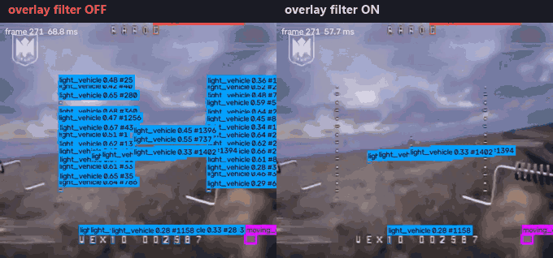
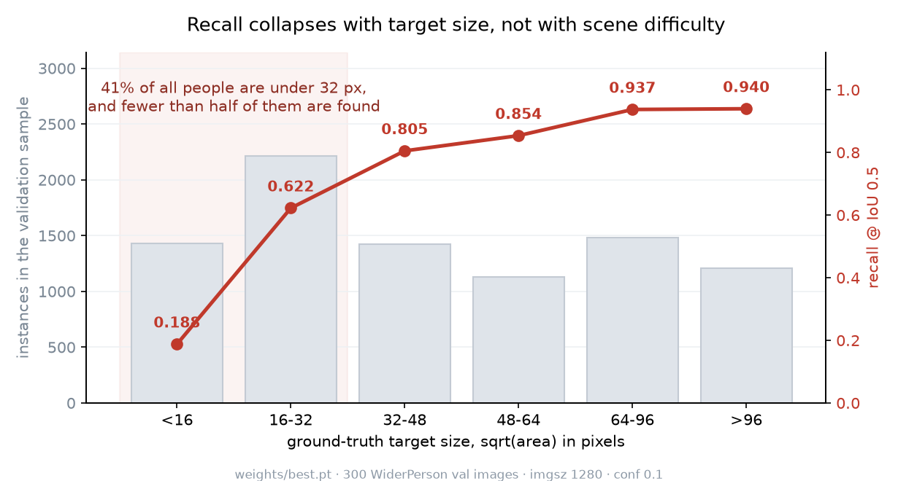
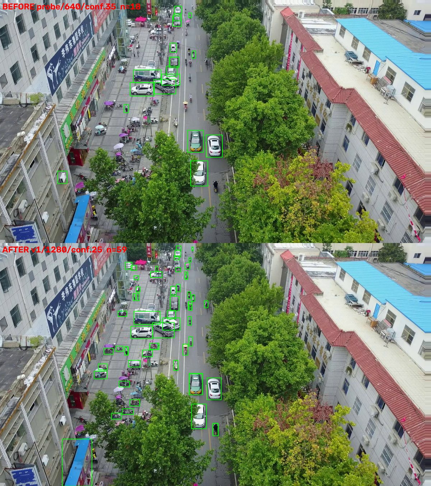
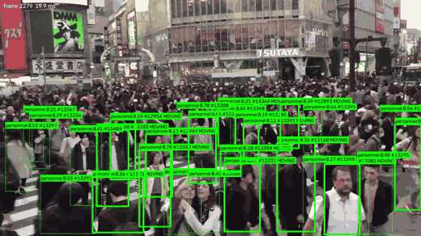
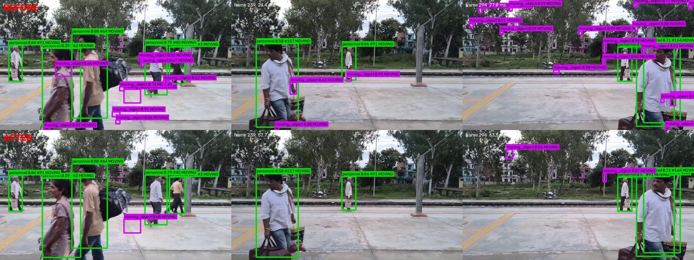
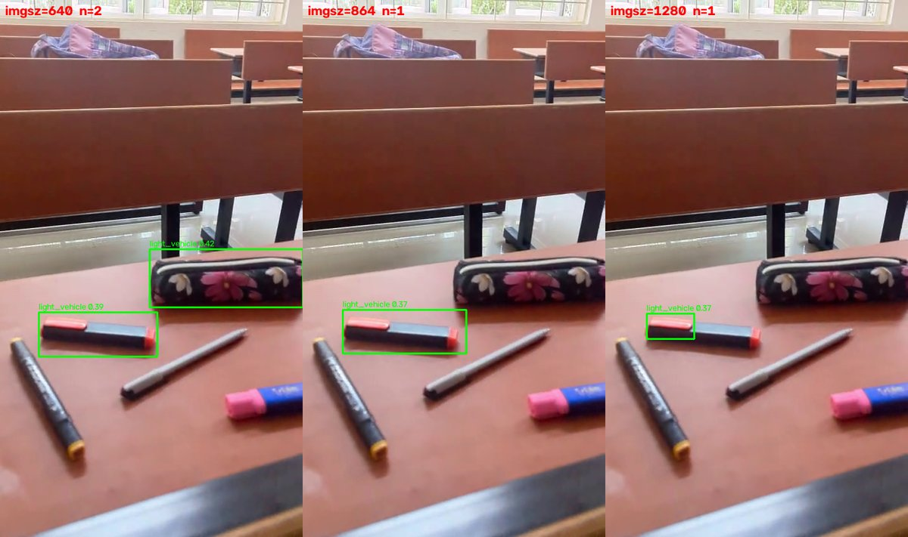

# DetecSight

**Real-time detection and tracking of people and vehicles in drone and
body-worn camera video.** A YOLO26 detector, an ego-motion-compensated motion
channel and a HUD-overlay filter, served over FastAPI as a TensorRT FP16 engine
at 6.95 ms/frame.

[](https://github.com/24f2006988/Detecsight/actions/workflows/ci.yml)
[](https://www.python.org/downloads/)
[](LICENSE)



*The same eleven seconds of FPV drone footage, run twice. Left: 31.3 phantom
`light_vehicle` boxes per frame on a clip containing no vehicles. Right: the
same clip with the overlay filter on. Same weights, same thresholds — the only
difference is the filter.*

## Try it without an NVIDIA card

```bash
docker build -t detecsight .
docker run -p 8000:8000 detecsight
```

Swagger UI at `http://localhost:8000/docs`; `POST /detect` a JPEG and you get
boxes back. The image is CPU-only and honest about it: roughly **709 ms** per
1280 px frame, against 6.95 ms for the TensorRT FP16 engine on a GPU. It is a
way to see the system work, not a way to deploy it.

---

## The overlay filter

One FPV clip produced **54,658 `light_vehicle` boxes across 1,746 frames** —
31.3 per frame, on footage containing no vehicles at all. A spatial heatmap of
those boxes reproduced the HUD exactly: one box per dash of each dotted reticle
line, one per character of the telemetry string, median box 9×9 px.

The earlier diagnosis had been "no training coverage of this camera angle" and
the proposed fix was more training data. Both were wrong. **The boxes were never
on the scene.**

The fix that works is not appearance-based but ***attachment*-based**. A painted
glyph holds its position in image space while the world slides underneath it; a
real object is attached to the world and travels across the frame as the camera
pans. So the filter learns which grid cells keep producing **small** detections
**while the camera is independently established to be moving** — reusing the ego
estimate the motion pass already computes, at no extra cost.

| | before | after |
|---|---|---|
| phantom `light_vehicle` | 54,658 (31.3/frame) | **6,713 (3.84/frame)** — −87.7% |
| control clip | — | **byte-identical** output |

It never masks a large box, however persistent — that is what protects a target
a drone is deliberately holding centred in frame — and past
`OVERLAY_MAX_FRACTION` it disables itself entirely rather than risk blinding the
detector. Both properties are asserted in `tests/test_overlay_mask.py`.

A detail worth keeping: **rolling-median burst detection reports zero bursts on
this failure**, because a constant per-frame error is not a spike. Burst counts
alone will never find this class of bug.

## How a checkpoint is allowed to ship

Nothing here is promoted because its mAP went up. It ships because it clears a
gate, and the gate is one command:

```bash
python scripts/evaluate.py                                  # what is deployed
python scripts/evaluate.py runs/detect/<run>/weights/best.pt  # a candidate
```

Four criteria, PASS/FAIL, non-zero exit on failure: no overall mAP50 regression,
no `personnel` regression, no class silently collapsed to zero, and a recall
floor that catches a degenerate model predicting almost nothing. Alongside them
it reports size-stratified recall — **the metric that actually limits this
system**, and the one overall mAP50 hides:



Near targets are effectively solved at 0.94. All the loss is distance, and
distance is not rare: 41% of the people in ground-level validation are under
32 px, and fewer than half of those are found. Raising resolution does not fix
it — 1280→1536 buys +0.4% detections for +46% cost, and the *large* buckets get
worse, because above the trained size the model is off-distribution for its own
scale priors. The remaining lever is data.

### What the gate has actually decided

| candidate | measured | decision |
|---|---|---|
| `battlesight_fpv` vs. the then-deployed checkpoint (blended val) | mAP50 0.5910 → **0.6274**, personnel 0.6785 → **0.7064**, recall 0.540 → 0.570, no class collapsed | **promoted** |
| VisDrone-only drone specialist, judged on its *own* home domain (VisDrone val) | overall 0.5036 → 0.6274, personnel **0.3162 → 0.7064** with the blended checkpoint | **retired** — the specialist lost on the domain it was specialised for |
| TensorRT INT8 engine (VisDrone val) | 4.23 ms vs FP16's 6.95 ms, but mAP50 0.5608 → 0.5189 and recall 0.5303 → 0.4789 | **rejected** — at ~10 fps, 2.7 ms buys nothing visible; 5 points of recall is visible |
| Far-field second pass, on by default | +4–8% more people found, but p90 48.5 ms against a 26.9 ms median | **kept, off by default** — the jitter would make an AR overlay stutter |

The rejections are the interesting rows. A full list of what was tried and
abandoned, each with the number that killed it, is at the top of
[`ENGINEERING_LOG.md`](ENGINEERING_LOG.md).

## Results

Every number below has a command in [`docs/REPRODUCE.md`](docs/REPRODUCE.md).

| | | reproduce |
|---|---|---|
| Deployed checkpoint | mAP50 **0.638**, mAP50-95 0.389 (blended val) | `scripts/evaluate.py` |
| Inference resolution 640→1280, conf 0.35→0.25 | VisDrone val mAP50 0.5046 → 0.5623, recall 0.4855 → 0.5262 | `scripts/eval_rubric.py` |
| PyTorch FP32 → TensorRT FP16 | 13.3 ms → **6.95 ms**/frame | `scripts/bench_imgsz.py` |
| HUD overlay filter | 54,658 → **6,713** phantom boxes, −87.7% | `scripts/diagnose_bursts.py` |
| Personnel floor 0.20 → 0.10, chosen on **F2 not F1** | recall 0.636 → **0.725** for 5.7 pts of precision | `scripts/eval_size_recall.py` |
| Motion stage moved off the critical path | 46.4 → **24.6 ms** median, detection counts byte-identical | `BATTLESIGHT_MOTION_PARALLEL=0/1` |
| Size-stratified recall | <16 px **0.187** · 16–32 0.622 · >96 0.940 | `scripts/eval_size_recall.py` |

F2 rather than F1 is a deliberate choice: F1 weights precision and recall
equally, which contradicts the principle every gate in this system is built on.
A missed contact is the failure that matters; a phantom is a nuisance.

Inference resolution was the first real fix, and the least clever one: the
deployed checkpoint had been running at imgsz 640 with a 0.35 confidence floor,
both inherited defaults, neither measured.



*Same frame, imgsz 640 → 1280 and conf 0.35 → 0.25. The parked two-wheelers
under the awnings and the pedestrians on the near pavement are recovered rather
than invented — they are visible in the source frame. Note the false positive on
the blue roof at bottom-left: the lower floor is not free.*

**Latency on this machine varies about 3× run to run** — the same unchanged path
has measured 25, 46 and 74 ms in one session. Only warmed, back-to-back,
within-run comparisons are trustworthy, and the figures above are all taken that
way.

## Tracking in dense scenes



*A pedestrian crossing at rush hour: track IDs and the moving flag, held through
mutual occlusion. Median 19 tracked people per frame, peaking at 78, across
2,281 unique track IDs over the clip.*

This is also where the system's limits are clearest, and
[`ENGINEERING_LOG.md`](ENGINEERING_LOG.md) §20 records them rather than the
highlight: the near field is tracked well and the standing crowd behind it —
several hundred people at 10–25 px — is largely missed, exactly as the
size-recall curve predicts. Over half of all returned boxes are larger than
96 px in a scene dominated by small people.

## How it works

Four classes — `personnel`, `two_wheeler`, `light_vehicle`, `heavy_vehicle` —
plus a class-agnostic `moving_object` (`class_id -1`) from an independent motion
channel, so something moving coherently is still reported when the classifier
has no name for it.

`Detector.track()` is five stages, and each exists because of a measured failure
rather than a guess:

1. **Motion channel** (`app/motion_filter.py`) — background subtraction with
   ego-motion compensation. A frame-to-frame affine transform is fit by
   Shi-Tomasi corners + Lucas-Kanade flow + RANSAC, the previous frame is warped
   into the current one so static structure differences away, and stored track
   histories are warped by the same transform so trajectory *straightness*
   measures the object rather than the camera. Four independent gates suppress
   chronic noise.
2. **Illumination-vs-structure discriminator** — separates a light (muzzle
   flash, headlight, glare) from a real object in a single frame by testing
   whether the change is a uniform brightness shift or preserves structure under
   z-scoring. A fast path reports targets visible for only two frames, which the
   four-frame coherence requirement could never do.
3. **Classification** — full-frame inference, plus an optional strided far-field
   second pass that re-examines wherever the small boxes already are.
4. **Static overlay rejection** (`app/overlay_mask.py`) — the HUD filter above.
5. **Reference-image exclusion** (`app/exclusion.py`) — upload one photo of an
   object and matching detections are dropped, via a MobileNetV3 embedding and
   cosine similarity. No retraining, no new class.

**Every stage fails open.** Any gate that cannot judge passes the detection
through. A phantom contact is a nuisance; a suppressed real one is the failure
this system must not have.



*The motion channel's chronic-noise gates, before and after. Purple
`moving_object` boxes are the class-agnostic motion channel; green are
classified `personnel`. The phantom purple boxes on foliage and platform edge
are gone while the classified detections carry through untouched — the track IDs
(`#91`, `#64`, `#62`, `#45`, `#157`) are identical before and after. That is the
property the filter is held to: it may only remove what it can prove is noise.*

One checkpoint serves both `?view=` values, differing only through config
(personnel confidence floor, motion-coherence threshold) — see the retirement
row above. Drop a `weights/drone_best.pt` in and `?view=drone` picks it up
again; `/health` reports `views_loaded` so a client can tell which case it is.

## API

| endpoint | purpose |
|---|---|
| `GET /health` | model/device/class state, per-feed tracker sizes |
| `POST /detect` | single frame, stateless |
| `POST /detect/tracked` | frame-in-stream over HTTP, track IDs + motion flags |
| `WS /ws/track/{source_id}` | live feed: send JPEG bytes, receive JSON per frame |
| `POST /webrtc/offer/{source_id}` | live feed over WebRTC, detections on a data channel |
| `POST /train`, `GET /train/{id}` | launch and monitor a fine-tuning run |
| `POST /exclude` | upload a reference image to suppress |

Boxes are **normalised to 0–1** so a client can scale to its own viewport
without knowing the source resolution.

Each `source_id` gets its own tracker, background model, motion history and
overlay mask — state never leaks between feeds. Ultralytics hangs a single
tracker off the predictor and reuses it for every call, so this had to be
managed explicitly; `tests/test_feed_isolation.py` holds it to that.

## Known limitations

Kept, not hidden. These are the honest edges of the system.

- **Personnel in vegetation from a UAV are still missed.** Resolution, palette,
  viewpoint and augmentation have each been ruled out by direct experiment; what
  remains is pose — nothing in the training mix contains prone or crawling
  people seen from above.
- **Ground-level vehicle recall has collapsed.** On dense urban footage,
  0.07 `light_vehicle` per frame on frames plainly containing six — against
  mAP50 0.860 for that class on the blended validation set. A stock COCO
  control finds 5.80/frame on the same frames, and the deployed model finds
  4.60/frame at conf 0.02: it *localises* the vehicles correctly and assigns
  them near-zero confidence. The cause is an asymmetry in training coverage —
  `personnel` has both aerial and ground-level data, the vehicle classes have
  aerial only, so the model has learned "a vehicle is a small object seen from
  above." Diagnosis and the measurements in §20; the fix is ground-level
  vehicle data, and a ground-level val split to measure it with.
- **Confident false positives off-distribution.** Nothing in the training data
  resembles an indoor close-range scene, and the model has no learned notion of
  "not a vehicle" for that viewpoint:

  

  *`light_vehicle` at 0.39–0.42 on a pencil case and a highlighter, across three
  inference resolutions. Raising resolution removes one of the two boxes and
  tightens the other; it does not remove the failure. This is a training-data
  gap, not a threshold to tune, and it is why the confidence floor sits at 0.25
  rather than the 0.16 where mean F1 actually peaks.*

- **No UAV-as-target class.** VisDrone is footage taken *from* drones, not *of*
  them. This needs UAV-labelled data and a fifth class.
- **~10 fps tracked throughput** at imgsz 1280, and per-frame cost scales with
  detection count — 46 ms median on a crowd against 25 ms on sparse footage.
- **One GPU, serialised.** The threadpool keeps the event loop responsive; it
  does not make inference parallel.
- Training job state is in-memory and CORS is `*` — both fine for a laptop,
  neither fine for a real deployment.

## Setup from source

```bash
pip install -e ".[serve]"           # add gpu for TensorRT, train for augmentation
bash scripts/fetch_weights.sh v1.0.0
python scripts/check_gpu.py          # must print CUDA available: True
uvicorn app.main:app --host 0.0.0.0 --port 8000
```

Do not use `--reload` — it reloads the model onto the GPU on every file change.

The checkpoint is a [release](../../releases) asset rather than a tracked file:
20 MB of binary that changes wholesale on every retrain is what git stores
worst. `fetch_weights.sh` verifies it against the published sha256, because a
truncated checkpoint otherwise fails deep inside `torch.load` with an unhelpful
error.

Environment variables use a `BATTLESIGHT_` prefix, from the project's original
name. Every threshold in `app/config.py` is overridable that way, and each is
commented with the measurement that justifies its value.

### Tests

```bash
pytest              # 22 property tests, no GPU and no checkpoint needed, ~0.5 s
pytest -m model     # needs a checkpoint and the torch stack
pytest -m server    # needs a running uvicorn
pytest -m ""        # everything
```

They assert safety properties rather than happy paths: that the overlay filter
never masks a large box and fails open, that coherent motion survives and
foliage jitter does not, that a light is distinguished from an object in one
frame, that track history stays bounded under LRU eviction, and that feeds keep
independent state.

The default subset imports nothing heavier than OpenCV — no torch, no
ultralytics — which is what lets it run in CI in seconds. That boundary is
asserted on every push rather than trusted.

## Layout

```
app/       config, detector cascade, motion filter, overlay mask,
           exclusion store, FastAPI routers, training manager
scripts/   dataset conversion, training, TensorRT export, annotation,
           benchmarking, burst regression, the promotion gate
tests/     property tests, hardware requirements as pytest markers
data/      4-class dataset configs
docs/      figures, and REPRODUCE.md
```

Datasets, training runs and captured footage are not tracked. The dataset yamls
carry no absolute paths — they anchor at VisDrone and reach its siblings with
`../`, so they resolve against whatever you set once with
`yolo settings datasets_dir="<path>"`.

## Scope

Operator situational awareness: the system reports what is in frame and what is
moving, to a human who decides what it means. It is not fire control, not
automated targeting, and not combatant classification — it detects four generic
object classes and flags coherent motion, nothing more.

The same capability — finding people and vehicles from an aerial or body-worn
camera — is what search and rescue, crowd safety and infrastructure inspection
need. The hardest open problem here, finding a prone person in vegetation from a
UAV, is a search-and-rescue problem stated exactly.

## Licence and provenance

MIT — see [`LICENSE`](LICENSE). The training datasets carry their own terms:
VisDrone, WiderPerson, AerialPerson and CrowdHuman are each licensed for
research use by their authors, and the checkpoints inherit those terms.

The engineering in `app/`, `scripts/` and `tests/` is mine. It began as part of
a Smart India Hackathon team project, published under the team lead's account as
[Fusion-Sight](https://github.com/soumik15630m/Fusion-Sight); this repository is
that work under my own name, with a fresh history. The two have diverged — this
one is where development continues.
